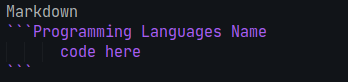

# Markdown Tutorial


# :book: Summary 
Markdown is a lightweight markup language for creating formatted text using a plain-text editor. John Gruber and Aaron Swartz created Markdown in 2004 as a markup language that is appealing to human readers in its source code form. Markdown is widely used in blogging, instant messaging, online forums, collaborative software, documentation pages, and readme files.

# :pushpin: Heading 


```Markdown
# Heading 1
## Heading 2
### Heading 3
#### Heading 4
##### Heading 5
###### Heading 6
```

# :page_facing_up: Paragraph and Comment 
    [//]: <> (This is also a comment.)

Ketsadaphone BOUTPANYDA  
Web Developer

```Markdown
Ketsadaphone BOUTPANYDA  (Double tap to enter a new line)
Web Developer

```

# :orange_book: Unordered List  
1. List and Sub-list
* coffee
  * mocha
  * latte
    * large
    * medium
    * small

```Markdown
* coffee
  * mocha
  * latte
    * large
    * medium
    * small
```

- tea
- water
- softdrink
```Markdown
- tea
- water
- softdrink

```


# :closed_book: Order List 
1. Sunday
2. Monday
3. Tuesday
```Markdown
1. Sunday
2. Monday
3. Tuesday
```

## Another Example of Order List
1. Sunday
1. Monday
1. Tuesday
```Markdown
1. Sunday
1. Monday
1. Tuesday
```

# :green_book: Emphasis 
1. Italic  
- *This text will be italic*  
- _This text will be italic_
  ```Markdown
  - *This text will be italic*  
  - _This text will be italic_
  ```

2. Bold  
- **This text will be bold** 
- __This text will be bold__
  ```Markdown
  - **This text will be bold** 
  - __This text will be bold__
  ```

3. Combine
- **You can combine _Italic_**
- *You can combine __Bold__*
- ```Markdown
  - **You can combine _Italic_**
  - *You can combine __Bold__*
  ```

# :bookmark_tabs: Contents 
[ct1](#content-1)  
[ct2](#content-2)  
[ct3](#content-3)  

### Content 1
### Content 2
### Content 3

```Markdown
### Content 1
### Content 2
### Content 3

[ct1](###content-1)  
[ct2](###content-2)  
[ct3](###content-3)  
```

# :thumbsup: Blockquote  
> Nothing i can't do
```Markdown
> Nothing i can't do
```

# :globe_with_meridians: Hyperlinks 
[Youtube](https://youtube.com)  
[Facebook](https://facebook.com)

```Markdown
[Youtube](https://youtube.com)  
[Facebook](https://facebook.com)
```

## :milky_way: Images 

VS Code 

```Markdown

```

JetBrains   

```Markdown

```

Programmer 

```Markdown

```

# :pencil: BACKSLASH ESCAPES 
\*This is BACKSLASH ESCAPE\*
```Markdown
\*This is BACKSLASH ESCAPE\*
```


# :computer: Code Snippet  
Markdown  


JavaScript
```js
  Function alert(){
    alert('Hello');
  }
```
C
```c
  printf("Hello World");
```

# :ballot_box_with_check: Task Lists  
- [X] This is completed task!
- [ ] This is uncompleted task!
```Markdown
- [X] This is completed task!
- [ ] This is uncompleted task!
```

# :ledger: Tables
First Header | Second Header
------------ | -------------
This is data | This is cel 2

```Markdown
First Header | Second Header
------------ | -------------
This is data | This is cel 2
```
# :smile: Emoji 
:+1:  :sparkles:  :camel:   :rocket:  :tada:
```Markdown
:+1:  :sparkles:  :camel:   :rocket:  :tada:
```