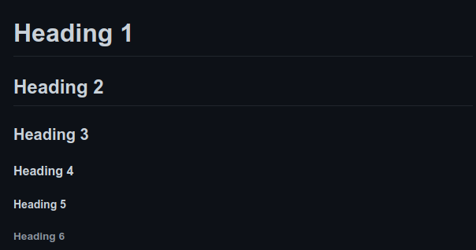

# ສອນຂຽນ Markdown


# :book: ສະຫລຸບ 
Markdown is a lightweight markup language for creating formatted text using a plain-text editor. John Gruber and Aaron Swartz created Markdown in 2004 as a markup language that is appealing to human readers in its source code form. Markdown is widely used in blogging, instant messaging, online forums, collaborative software, documentation pages, and readme files.

# :pushpin: Heading (ຫົວຂໍ້)
ໃນການເຮັດຫົວຂໍ້ນັ້ນແມ່ນຄ້າຍຄືກັບພາສາ HTML ເຊິ່ງຈະມີຢູ່ 6 ລະດັບຕັ້ງແຕ່ 1-6 ແລະ ໃຊ້ເຄື່ອງໝາຍ __#__  

__Preview__



__Code__
```Markdown
# Heading 1
## Heading 2
### Heading 3
#### Heading 4
##### Heading 5
###### Heading 6
```

# :page_facing_up: ຕົວໜັງສື ແລະ ຄອມເມັ້ນ 
ໃນການທີ່ຈະຂຽນຄອມເມັ້ນໃນຟາຍ Markdown ນັ້ນແມ່ນຈະມີວິທີຂຽນດັ່ງລຸ່ມນີ້:

__Code__
```Markdown
[//]: <> (ນີ້ແມ່ນຄອມເມັ້ນໃນພາສາ Markdown.)
```

__ໃນສ່ວນຂອງຕົວໜັງສືທຳມະດານັ້ນ ເຮົາສາມາດພິມລົງໄປປົກກະຕິໄດ້ເລີຍ.__  

ເກດສະດາພອນ ບຸດປານີດາ  
ນັກອອກແບບ ແລະ ພັດທະນາເວັບໄຊ້ສ

__ໃນການລົງແຖວນັ້ນສາມາດເຮັດໄດ້ດ້ວຍການ ຍະຫວ່າງສອງເທື່ອ.__

__Code__
```Markdown
Ketsadaphone BOUTPANYDA  (ຍະຫວ່າງສອງເທື່ອເພື່ອລົງແຖວໃໝ່)
Web Developer

```

# :orange_book: ລາຍການແບບບໍ່ໄດ້ລຽງລຳດັບ  
__1. ລາຍການຫລັກ ແລະ ລາຍການຍ່ອຍ__  
ໃນການສ້າງລາຍການແບບບໍ່ລຽງລຳດັບນັ້ນ ເຮົາສາມາດເຮັດໄດ້ດ້ວຍການໃຊ້ເຄື່ອງໝາຍ __* ແລະ -__ ນອກນັ້ນຖ້າຕ້ອງການເຮັດລາຍການຍ່ອຍແມ່ນໃຫ້ເຮົາລົງແຖວແລ້ວກົດ __Tab.__
* coffee
  * mocha
  * latte
    * large
    * medium
    * small

__Code__
```Markdown
* coffee
  * mocha
  * latte
    * large
    * medium
    * small
```

- tea
- water
- softdrink

__Code__
```Markdown
- tea
- water
- softdrink

```


# :closed_book: ລາຍການແບບລຽງລຳດັບ 
ໃນການສ້າງລາຍການແບບລຽງລຳດັບນັ້ນ ເຮົາສາມາດເຮັດໄດ້ດ້ວຍການໃຊ້ຕົວເລກເຂົ້າໄປ ເຊິ່ງຈະເປັນຕົວເລກໃດກໍ່ໄດ້.
1. Sunday
2. Monday
3. Tuesday

__Code__
```Markdown
1. Sunday
2. Monday
3. Tuesday
```

## ຕົວຢ່າງການຂຽນລາຍການແບບລຽງລຳດັບອີກແບບ
1. Sunday
1. Monday
1. Tuesday

__Code__
```Markdown
1. Sunday
2. Monday
3. Tuesday
```

# :green_book: ລັກສະນະຕົວອັກສອນ
__1. ແບບເນີ້ງ__  
- *This text will be italic*  
- _This text will be italic_

__Code__
  ```Markdown
  - *This text will be italic*  
  - _This text will be italic_
  ```

__2. ແບບເຂັ້ມ__
- **This text will be bold** 
- __This text will be bold__

__Code__
  ```Markdown
  - **This text will be bold** 
  - __This text will be bold__
  ```

__3. ແບບປະສົມ__
- **You can combine _Italic_**
- *You can combine __Bold__*

__Code__
- ```Markdown
  - **You can combine _Italic_**
  - *You can combine __Bold__*
  ```

# :bookmark_tabs: ສາລະບານ
[ct1](#content-1)  
[ct2](#content-2)  
[ct3](#content-3)  

### Content 1
### Content 2
### Content 3

ໃນການເຮັດສາລະບານນັ້ນ ຕົວສາລະບານຈະນັບແຕ່ __Heading__ ເທົ່ານັ້ນ ແລະ ມີຮູບແບບໃນການຂຽນດັ່ງນີ້:

__Code__
```Markdown
### Content 1
### Content 2
### Content 3

[ຊື່ລາຍການ](ຊື່ຫົວຂໍ້ທີ່ເຮົາໃຊ້ອ້າງອີງ) 
[ct1](###content-1)  
[ct2](###content-2)  
[ct3](###content-3)  
```

# :thumbsup: Blockquote ຄຳເວົ້າທີ່ສຳຄັນຂອງບຸກຄົນໃດໜຶ່ງ
> ບໍ່ມີຫຍັງທີ່ຂ້ອຍເຮັດບໍ່ໄດ້

ໃນການເຮັດໃຫ້ຄຳເວົ້າໃດໜຶ່ງທີ່ນຳມາປະກອບໃສ່ໃນຟາຍເອກະສານ ຫລື ວ່າ Blockquote ທີ່ສຳຄັນໆນັ້ນສາມາດເຮັດໄດ້ດ້ວຍການໃຊ້ເຄື່ອງໝາຍ __>__

__Code__
```Markdown
> ບໍ່ມີຫຍັງທີ່ຂ້ອຍເຮັດບໍ່ໄດ້
```

# :globe_with_meridians: Hyperlinks ການແນບລິ້ງ
[Youtube](https://youtube.com)  
[Facebook](https://facebook.com)

ໃນການແນບລິ້ງເຂົ້າມານັ້ນກໍ່ເຮັດຄ້າຍຄືກັນກັບວິທີການຂຽນສາລະານເລີຍ ແລະ ມີຮູບແບບວິທີຂຽນດັ່ງລຸ່ມນີ້:

__Code__
```Markdown
[ຊື່ເວັບໄຊ້ສ](ລິ້ງເວັບໄຊ້ສ)
[Youtube](https://youtube.com)  
[Facebook](https://facebook.com)
```

## :milky_way: ຮູບພາບ 
ໃນການເພີ່ມຮູບພາບເຂົ້າມາໃນຟາຍນັ້ນກໍ່ມີວິທີຂຽນຄ້າຍຄືກັບສາລະບານເຊັ່ນດຽວກັນ ພຽງແຕ່ຕື່ມເຄື່ອງໝາຍ __!__ ໄວ້ທາງໜ້າ. 

VS Code 


__Code__
```Markdown

```

JetBrains   


__Code__
```Markdown

```

Favorite Character  


__Code__
```Markdown

```

# :pencil: BACKSLASH ESCAPES ການໃຊ້ເຄື່ອງໝາຍພິເສດໃນຂໍ້ຄວາມ
\*This is BACKSLASH ESCAPE\*

ໃນການໃຊ້ເຄື່ອງໝາຍພິເສດໃນຂໍ້ຄວາມນັ້ນ ຕາມປົກກະຕິແລ້ວບາງເຄື່ອງໝາຍຈະໄປຊ້ຳກັບ ເຄື່ອງໝາຍຄຳສັ່ງຂອງພາສານັ້ນໆ ດັ່ງນັ້ນຈຶ່ງມີວິທີການແກ້ໄຂໂດຍການໃຊ້ເຄື່ອງໝາຍ \ __ໄວ້ທາງໜ້າ ແລະ ທາງຫລັງຂອງຂໍ້ຄວາມທີ່ມີເຄື່ອງໝາຍພິເສດ__

__Code__
```Markdown
\*This is BACKSLASH ESCAPE\*
```


# :computer: Code Snippet 

ໃນການນຳ Code ຂອງພາສາອື່ນໆເຂົ້າມາສະແດງຜົນນັ້ນສາມາດເຮັດໄດ້ຕາມວິທີດັ່ງລຸ່ມນີ້:  

__Code__
Markdown  


__Ex__  
JavaScript
```js
  Function alert(){
    alert('Hello');
  }
```
C
```c
  printf("Hello World");
```

# :ballot_box_with_check: Task Lists  ສິ່ງທີ່ຕ້ອງເຮັດ
- [X] This is completed task!
- [ ] This is uncompleted task!

ໃນການເຮັດ Task list ນັ້ນແມ່ນຈະມີຫລັກການດັ່ງນີ້
- ເຄື່ອງໝາຍ [ ] ໝາຍເຖິງບົ້ງບອກວ່າ ປະໂຫຍກໃນແຖວນີ້ແມ່ນ Task list.
- ເຄື່ອງໝາຍ [X] ໝາຍເຖິງບົ້ງບອກວ່າ ປະໂຫຍກໃນແຖວນີ້ແມ່ນໄດ້ເຮັດສຳເລັດແລ້ວ.

__Code__
```Markdown
- [X] This is completed task!
- [ ] This is uncompleted task!
```

# :ledger: ຕາຕະລາງ
First Header | Second Header
------------ | -------------
This is data | This is cel 2

ໃນການສ້າງຕາຕະລາງຈະມີຫລັກການດັ່ງລຸ່ມນີ້:
- ເຄື່ອງໝາຍ | ໝາຍເຖິງການຂີດຖັນ
- ເຄຶ້່ອງໝາຍ - ໝາຍເຖິງການຂີດແຖວ

__Code__
```Markdown
First Header | Second Header
------------ | -------------
This is data | This is cel 2
```
# :smile: Emoji ອິໂມຈິ
:+1:  :sparkles:  :camel:   :rocket:  :tada:

ນອກຈາກຕົວໜັງສືແລ້ວ Markdown ກໍ່ຍັງຮອງຮັບອິໂມຈິເຂົ້າມາເຮັດວຽກຮ່ວມນຳ

__Code__
```Markdown
:+1:  :sparkles:  :camel:   :rocket:  :tada:
```

__ສຳລັບໃຜທີ່ຕ້ອງການຫາລາຍຊື່ຂອງ Emoji ສາມາດເຂົ້າໄປຫາໃນລິ້ງລຸ່ມນີ້ໄດ້ເລີຍ__  
[Emoji Cheat Sheet](https://www.webfx.com/tools/emoji-cheat-sheet/)