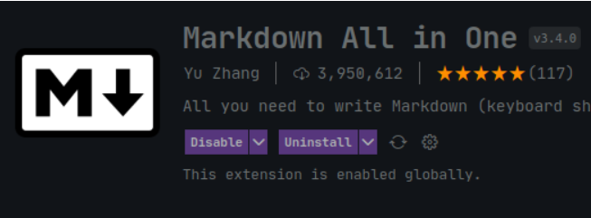

# :bust_in_silhouette: ແນະນຳຕົນເອງ

ເກດສະດາພອນ ບຸດປານີດາ  
ອາຍຸ 19 ປີ  
ສຶກສາຢູ່ທີ່ ມະຫາວິທະຍາໄລສະຫວັນນະເຂດ  
ຄະນະ ແລະ ສາຂາເຕັກໂນໂລຊີຂໍ້ມູນຂ່າວສານ

ປັດຈຸບັນກຳລັງສຶກສາໃນການພັດທະນາເວັບໄຊ້ສ ແລະ ສົນໃຈທີ່ຈະເປັນ Full Stack Web Developer.  

ໃນໂປຣເຈັກນີ້ຈະພາມາຮຽນຮູ້ກ່ຽວກັບການຂຽນພາສາ Markdown ເຊິ່ງເປັນອີກໜຶ່ງພາສາທີ່ຄວນຮຽນຮູ້ ຖ້າຫາກຕ້ອງການເຮັດໂປຣເຈັກເພື່ອເຮັດ Documentation ໃຫ້ກັບຄົນອື່ນເຂົ້າໃຈກັບໂປຣເຈັກຂອງເຮົາ.

# :computer: ກະກຽມເຄື່ອງມື

ກ່ອນທີ່ຈະມາຂຽນພາສາ Markdown ຂໍແນະນຳໃຫ້ຮູ້ກັບເຄື່ອງມື ແລະ ສ່ວນປະກອບເສີມ (Extension) ທີ່ຊ່ວຍໃຫ້ຂຽນ Markdown ສະດວກສະບາຍຂຶ້ນອີກ.

__1. Text Editor__  
ພາສາ Markdown ເປັນພາສາທີ່ຄ້າຍຄືກັບ HTML. ງ່າຍ ແລະ ມີຂະໜາດເບົາ ນັ້ນເປັນເຫດໃຫ້ເຮົາສາມາດຂຽນ, ແກ້ໄຂ ແລະ ສ້າງຟາຍທີ່ໃຊ້ພາສານີ້ໄດ້ງ່າຍ ບໍ່ວ່າຈະເປັນໂປຣແກຣມພິມຕົວໜັງສືທຳມະດາ (Text Editor) ຈົນໄປເຖິງ ໂປຣແກຣມແກ້ໄຂ ແລະ ພັດທະນາ Code (Code Editor).  

ແຕ່ກໍ່ມີໂປຣແກຣມທີ່ຈະມາແນະນຳຄື:  
__VS Code__
  

ເປັນໂປຣແກຣມທີ່ຍອດນິຍົມໃນໝູ່ໂປຣແກຣມເມີ້ ແລະ ນັກພັດທະນາສ່ວນໃຫ່ຍ ເພາະເປັນໂປຣແກຣມທີ່ມີຂະໜາດເບົາ, ສາມາດປັບແຕ່ງໄດ້ຕາມຄວາມຕ້ອງການ ແລະ ສາມາດພັດທະນາໂປຣແກຣມໄດ້ເກືອບທຸກພາສາ.  

__2. Extension__
ຖ້າຫາກໃຊ້ໂປຣມ VS Code ກໍ່ສາມາດຕິດຕັ້ງ Extension ທີ່ແນະນຳໄດ້ລຸ່ມນີ້ເລີຍ:  

*__Markdown All in One__*
  

ເປັນສ່ວນເສີມ (Extension) ທີ່ຊ່ວຍໃຫ້ເຮົາສາມາດຂຽນພາສາ Markdown ໄດ້ງ່າຍ ແລະ ປະຢັດເວລາໄດ້ຫລາຍ. ເຊິ່ງມີ Features ດັ້ງນີ້:  

- ປຸ່ມລັດ
- ສາລະບານແບບ Auto
- ພີວີວຟາຍແບບ Realtime
- ແລະ ອື່ນໆອີກຫລາຍຢ່າງຖ້າໃຫ້ສຳຫລວດ້ວຍຕົນເອງຢູ່ :kissing: